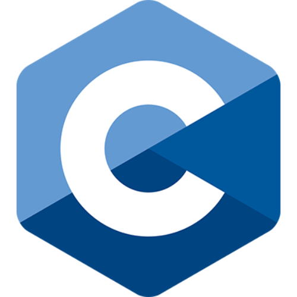
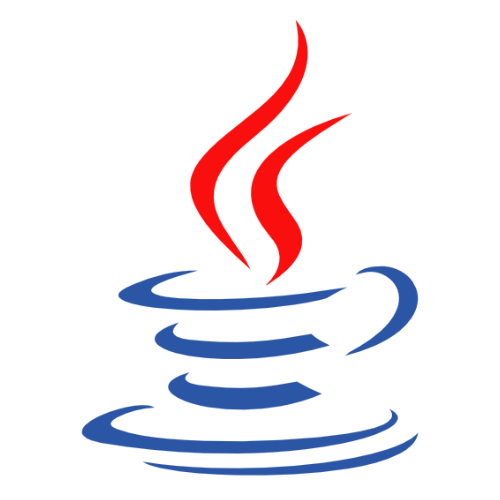

## 👋 Hey! I'm Nigel

I'm a second year **Computer Science** student at the **University of Guelph**.

I have experience with programming languages such as **C**, **Python**, and **Java**. More recently, I have been expanding my skill set by learning basic web development using **HTML**, **CSS**, and **JavaScript**.

### Programming Languages and Tools

 
 

### Connect with me

[][email]
[][linkedin]

 
 

checkout my website [nigeldavis.com][website]

[website]: https://www.nigeldavis.com
[linkedin]: https://www.linkedin.com/in/ngeldvis/
[email]: mailto:ngeldvis@gmail.com
